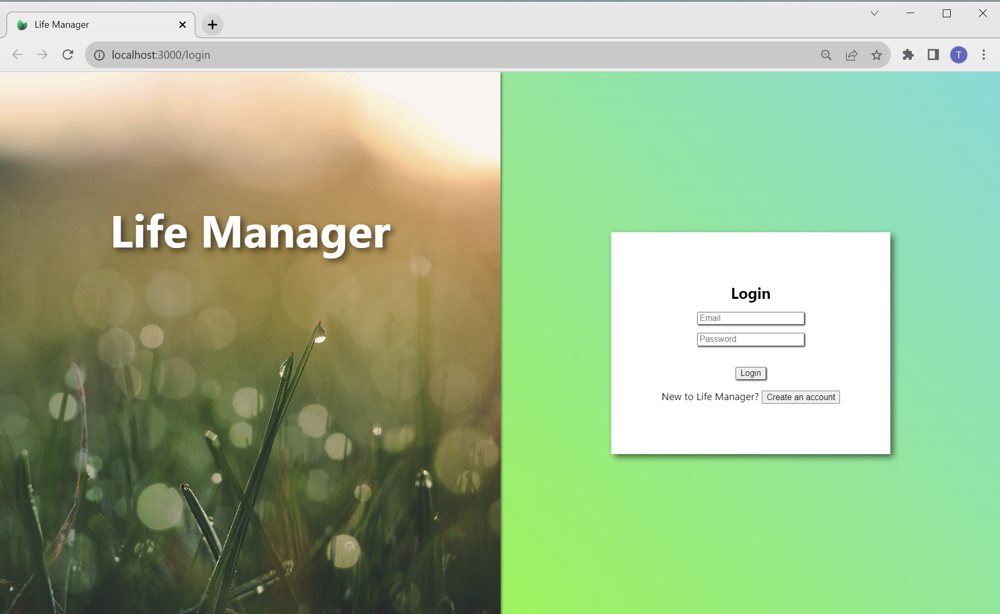
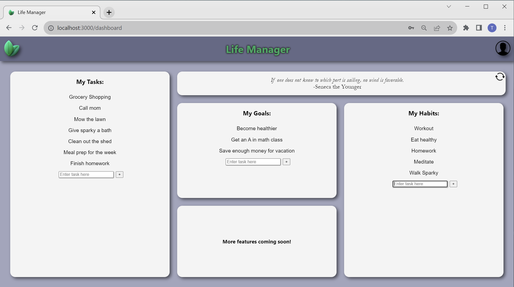

<a name="readme-top"></a>

<!-- PROJECT LOGO -->
<div align="center">
  <a href="https://github.com/tuckerhumiston/Life-Manager">
    
  </a>

# Life Manager: Your Path to Well-being
</div>

Welcome to Life Manager, a testament to my journey as a full stack developer. This repository showcases my ability to create a comprehensive web platform. Below, you'll discover an overview of the technologies harnessed, features realized, and methods to connect with me for further discourse.

<br/>

<div align="center">
  
  
</div>


## Introduction

In today's fast-paced world, it's essential to take care of our mental and emotional well-being. Life Manager offers a user-friendly web platform that combines elements of habit tracking, mood monitoring, personalized recommendations, and access to professional help. Our goal is to help users cultivate positive habits, understand their mental state, and seek support when needed, all in one place.

<br/>

## Key Features

- **Todo Lists:** Build interactive todo lists to visualize your daily tasks.
- **Goal Setting:** Write down your goals as a first step toward acheiving them.
- **Habit Tracker:** Keep track of your daily habits.
- **Inspirational Wisdom:** Recieve randomly fetched inspirational quotes from key public figures.

<br/>

## Technologies Used

List of technologies, languages, and tools I've used to build this project:

- Frontend: HTML, CSS, JavaScript
- Backend: Node.js, Express.js
- Database: PostgreSQL, Postbird
- Version Control: Git, GitHub
- Test Suite: Chai
- Deployment: Heroku
- API Documentation: Postman
- Security: bcrypt, express-session, helmet, express-validator, express-rate-limiter, cors, jsonwebtoken
- Other: Nodemon, Dotenv, pg, axios

### Web Security Enrichment
- Passwords are hashed using bcrypt
- User sessions are stored in cookies using express-session
- Security headers are set using helmet
- Data is sanatized and validated using express-validator
- DOM based precautions are taken to prevent XSS attacks
- Login rate limiting is established using express-rate-limiter

### Thorough Backend Test Suite
Every endpoint has undergone comprehensive testing leveraging Chai, ensuring the platform's reliability.

<br/>

## Getting Started

To explore the **Life Manager** platform locally and manage your own database, follow these steps:

### Prerequisites

- **Node.js:** Make sure you have Node.js installed. You can download it from [here](https://nodejs.org/).

### Installation

1. **Clone the Repository:** Begin by cloning this repository to your local machine:
```bash
git clone https://github.com/tuckerhumiston/Life-Manager.git
cd Life-Manager
```

2. **Install Dependencies:** Install the required dependencies for both the frontend and backend:

```bash
cd frontend
npm install
cd ../backend
npm install
```
### Database Setup
1. **Database Creation:** Create a PostgreSQL database for the application.

2. **Database Configuration:** In the backend directory, create a .env file and provide your database configuration:
```bash
DATABASE_URL=your_database_url
```

### Running the Application
1. **Start the Backend:** In the backend directory, run the following command to start the backend server:
```bash
npm start
```
This will start the Express.js server, connecting it to your database.

2. **Start the Frontend:** In the frontend directory, run the following command to start the frontend development server:
```bash
npm start
```
This will launch the frontend application in your browser.

### Accessing the Application
Open your web browser and navigate to http://localhost:3000 to access the Life Manager platform running locally.

<br/>

## Usage

Upon registering for an account, log in to the Life Manager platform to unlock an array of transformative features. Track your habits, set goals, and build todo lists to stay organized.

<br/>

## API Documentation

For a deeper dive into the technical details, refer to our API documentation: https://documenter.getpostman.com/view/27751094/2s9Y5YQgz4


<br/>

<div align="center">
  <p>Connect with me:</p>
  <a href="mailto:tuckerhumiston@hotmail.com">Email</a> |
  <a href="https://www.linkedin.com/in/tucker-humiston">LinkedIn</a> |
  <a href="https://github.com/tuckerhumiston">GitHub</a>
</div>
